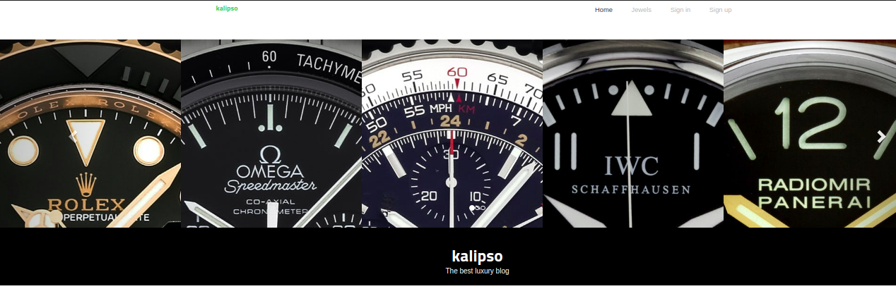
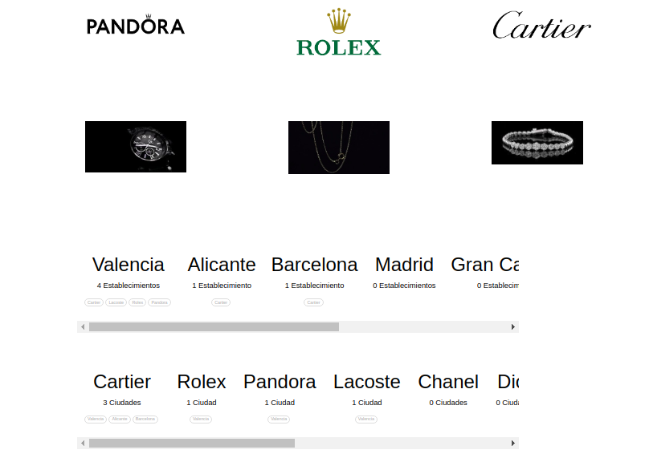
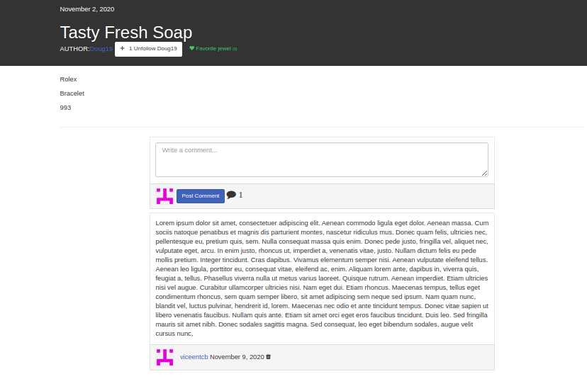
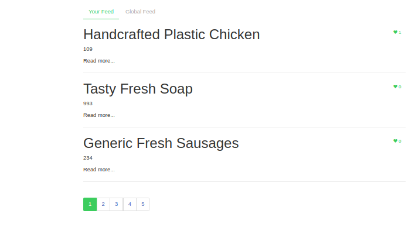

# JEWERLY BLOG
<p>This is a project of a jewelry blog, in which you can follow other users, you can save articles as favorites, in addition to being able to know where the stores are, as well as which stores each city has.</p>

<h2>Preview</h2>

<h3>Home</h3>

<p  align="center" ></p>

<h3>Jewel</h3>
<p  align="center" ></p>

<h3>List</h3>
<p  align="center" ></p>

<h2>Let's get started</h2>
<p>Before starting to use the application you must follow the following steps</p>

<h3>Pre requirements </h3>
<ol>
<li>Install node and npm</li>

&nbsp; ```apt install nodejs && apt install npm```

<li>Install mongo</li>
&nbsp; <a href="https://www.digitalocean.com/community/tutorials/como-instalar-mongodb-en-ubuntu-18-04-es">Install Mongo</a>

<li>Install gulp</li>
&nbsp <a href="https://tecadmin.net/install-gulp-js-on-ubuntu/">Install Gulp</a>
</ol>

<h3>Installation</h3>
<p>Now in each backend and then in the frontend we will execute the following:</p>
<ul>
<li> 

```npm install```

</li>
</ul>

<h3>Start</h3>
<p>Now that we have everything installed we are ready to start the application</p>
<ol>
<li>To start the backends, we will execute the following in each of them:</li>

&nbsp; ``` npm run dev ```

<li>To finish we will execute the following in the frontend</li>

&nbsp; ``` gulp ```

</ol>

<p>With this, we will be done and we can use the application</p>

<h2>Built with</h2>
<ul>
<li><a href="https://angularjs.org/">Angular JS</a> </li> 
<li><a href="https://nodejs.org/es/">Node JS</a>  </li>
<li><a href="https://expressjs.com/es/">Express</a> </li>
<li><a href="https://mongoosejs.com/">Mongoose</a></li>
<li><a href="https://www.mongodb.com/es">MongoDB</a> </li>
<li><a href="https://graphql.org/">GraphQL</a> </li>
</ul>


